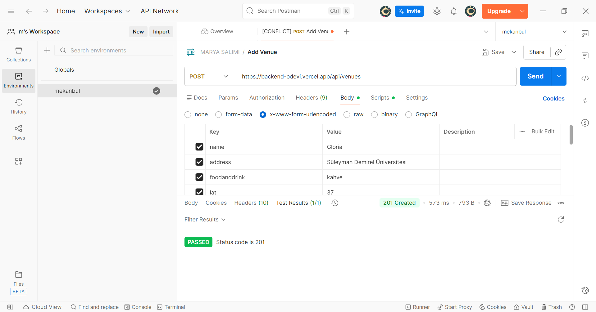
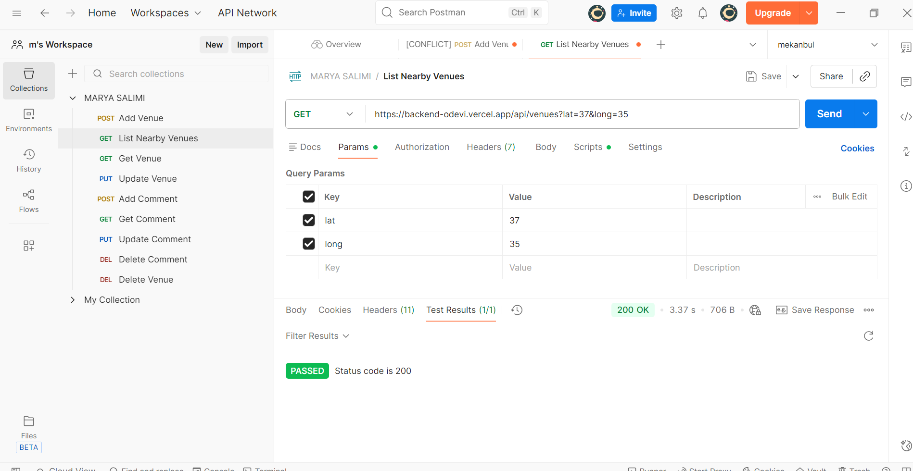
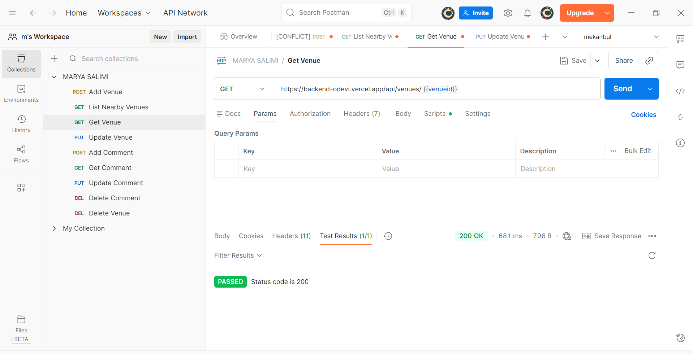
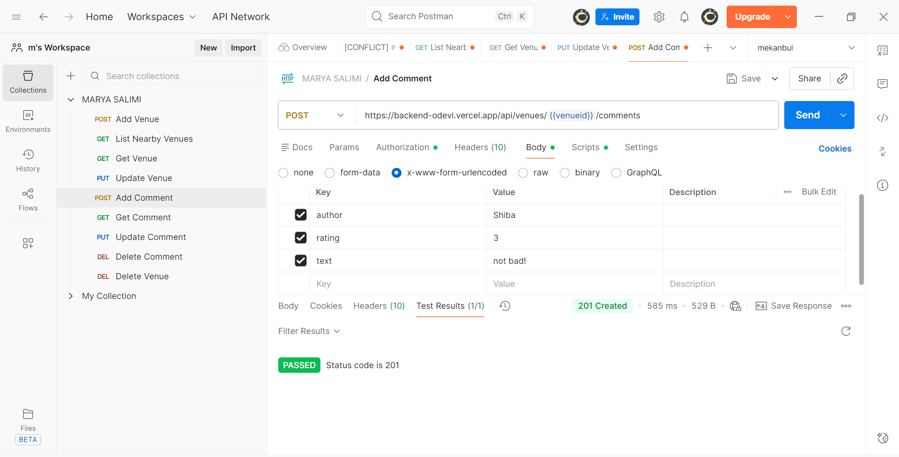
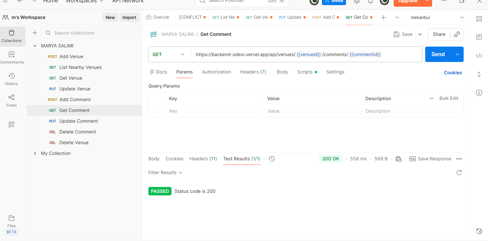
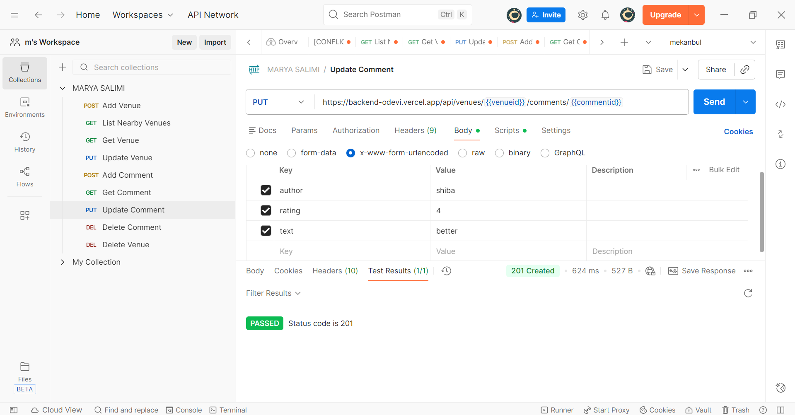
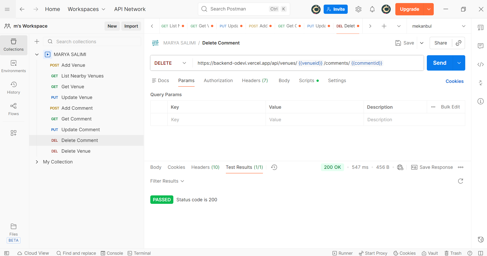
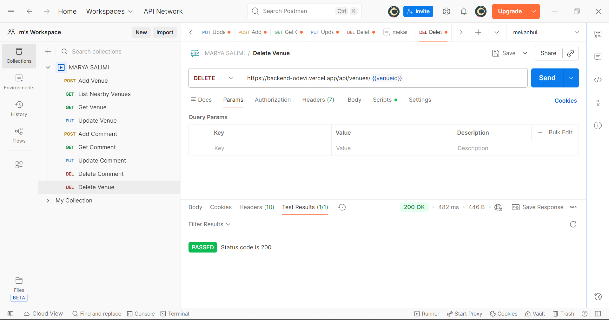
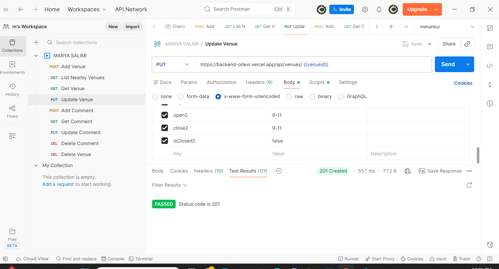

Bu proje, Node.js + Express kullanılarak geliştirilmiş bir backend uygulamasıdır ve Vercel üzerinde yayınlanmaktadır.

---

## 🌐 **Canlı API URL**

```
https://backend-odevi.vercel.app/
```

Bu adres tüm isteklerin **base URL** kısmıdır.


## 📦 **Proje Özeti**

* Node.js + Express backend
* Vercel üzerinde yayınlanır
* RESTful API mimarisi
* GitHub push → otomatik deploy
* Postman ile test edilebilir
* VS Code içinde `tests/` klasörü ve ekran görüntüleri bulunur.

---

## 🖼️ **tests/ Klasöründeki Görsellerin Gösterimi**

README içinden görüntülemek için:

```
# Test Resimleri

## Test 1


## Test 2  


## Test 3


## Test 4


## Test 5


## Test 6


## Test 7


## Test 8


## Test 9

```

